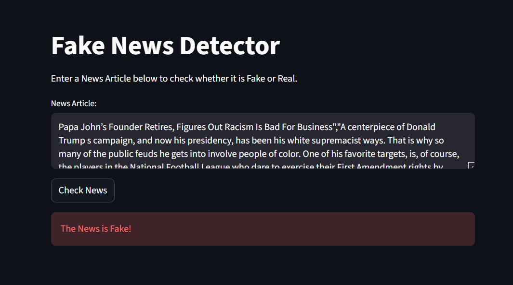

# Fake News Detection System

A Machine Learning based web application to classify news articles as Fake or Real using NLP techniques.

## Technologies Used
- Python
- Scikit-learn
- Streamlit
- Pandas

## Project Screenshots

### Fake News Prediction

### Real News Prediction
